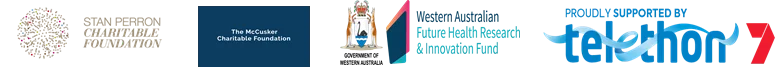
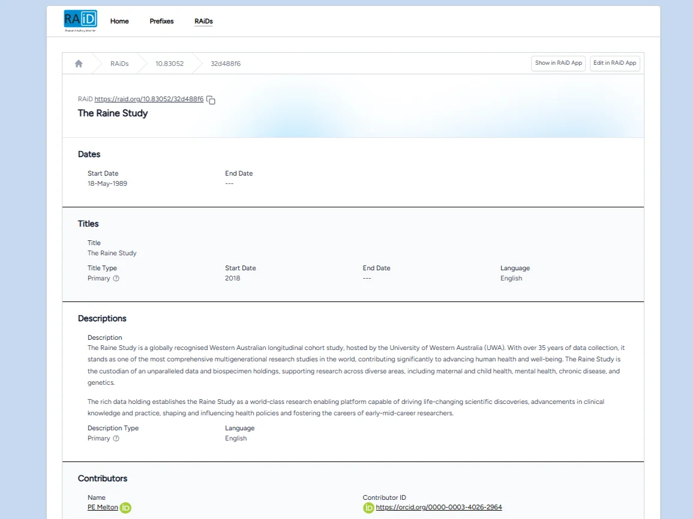

*This blog post introduces the Raine Study's use case for the Research Activity Identifier (RAiD).*

## The Raine Study – a world-class research-enabling platform

Established in Perth, Western Australia in 1989, the [Raine Study](https://rainestudy.org.au/) is one of the longest-running longitudinal cohort pregnancy studies in the world. The study aims to improve human health and wellbeing by examining how genetic, environmental, and behavioural factors interact across the life course. It is funded by a joint venture of five Western Australian universities, along with contributions from philanthropic sources.

*Raine Study partner organisations: the Raine Study is a joint venture among the five universities in Western Australia — [The University of Western Australia](https://www.uwa.edu.au/home), [Curtin University](https://www.curtin.edu.au/), [Edith Cowan University](https://www.ecu.edu.au/), [Murdoch University](https://www.murdoch.edu.au/), and [The University of Notre Dame Australia](https://www.notredame.edu.au/) — as well as [The Kids Research Institute Australia](https://www.thekids.org.au/) and the [Women and Infants Research Foundation](https://wirf.com.au/). It is supported by the [Stan Perron Charitable Foundation](https://www.perronfoundation.org.au/), the [McCusker Charitable Foundation](https://mccuskercharitable.com.au/), the [Government of Western Australia's](https://www.wa.gov.au/) [West Australian Future Health Research and Innovation Fund](https://fhrifund.health.wa.gov.au/), and [Telethon 7](http://telethon7.com/).*

<figure class="float-none sm:float-right w-full sm:w-72 sm:ml-6 mb-4 not-prose">
  
  <figcaption class="text-sm text-gray-500 italic mt-1">The Raine Study in numbers. <a href="/images/raine-study-in-numbers-large.webp" target="_blank" rel="noopener">View larger</a></figcaption>
</figure>

Over the course of its [37-year history](https://rainestudy.org.au/about-us/history/), the Raine Study has become multi-generational, recently recruiting its third generation:

- **Generation 1** – the original participants; the pregnant mothers recruited into the study and their partners (biological fathers of the fetuses)
- **Generation 2** – the children of Generation 1; the index participants of the Raine Study, who are now adults
- **Generation 3** – the children of Generation 2; the babies of the index participants
- **Generation 2b** – the other biological parent of Generation 3 babies, not born into the Raine Study

The study has collected, and continues to collect, comprehensive data from this cohort, including information on physical and mental health, behaviour, environment, and social, educational, and work outcomes. Participants return multiple times for [follow-ups](https://rainestudy.org.au/about-us/our-participants/the-follow-ups/), with Generation 2 completing up to 18 follow-ups, creating a research resource comprising more than 30,000 phenotypic data points, 30 million genetic data points, and 200,000 biosamples. The Raine Study is also expanding its data holdings through linkage with Western Australian administrative datasets.

These unique, multigenerational [data and biosample holdings](https://rainestudy.org.au/home-beta-2/information-for-researchers/data-and-biosamples/) have established the Raine Study as a world-class research-enabling platform that is driving life-changing scientific discoveries, advancing knowledge and clinical practice, and contributing to health policies worldwide. Since 1993, researchers using Raine Study data across ongoing projects in multiple health domains have produced [over 800 publications](https://rainestudy.org.au/our-research/publications/).

## Capturing and exposing the Raine Study with RAiDs

Being a joint venture between a number of different organisations, the Raine Study is a large and complex project. It has not only many partners and collaborators, but also many types of partners and collaborators — and that's before factoring in all of the research outputs of the study. It has been difficult to find a way to incorporate and capture the full scope of the Raine Study.

RAiD means the Raine Study can now easily and accurately represent its multi-institutional, multidisciplinary nature — tracking collaborators and outputs while recognising all of its partner organisations in one place. The seamless connections between RAiDs and [ORCID](https://orcid.org/) (Open Researcher and Contributor ID) and [ROR](https://ror.org/) (Research Organization Registry) identifiers ensure Raine Study collaborations are expressed via those persistent identifier systems as well.

With this in mind, the Raine Study team started by minting a [single RAiD](https://raid.org/10.83052/32d488f6) to cover the Raine Study as a whole. For the first time, everything is captured in one place: all outputs, partner organisations, core research staff, and collaborators. This has enhanced the discoverability of the Raine Study, enabling interested researchers and potential partner organisations to explore its extensive research network and resources. Because researchers are now including the overarching Raine Study RAiD in their publications at the study's request, this is also facilitating the tracking of outputs, and will ultimately enable automated updating of the RAiD with tagged outputs.

*The landing page of the RAiD for the Raine Study ([https://raid.org/10.83052/32d488f6](https://raid.org/10.83052/32d488f6)). [View larger](/images/raid-landing-page-large.webp).*

With the Raine Study more easily findable and accessible through its RAiD, the study can now direct government and other science policymakers to its RAiD landing page to see the entirety of the endeavour in a single snapshot — demonstrating the extensive network of Raine Study research and offering effortless perusal of its trove of research outputs when seeking evidence for policy decisions.

## The future – more RAiDs

The Raine Study is already thankful for RAiD, which has helped solve the difficulty of recording all facets of the study in a single place that can be easily found and understood by the community. Another major advantage of the RAiD system is that it provides the option to mint further RAiDs in future, connect them to the existing RAiD, and have outputs recorded across both. By assigning additional RAiDs to individual research projects within the Raine Study as needed, it will be possible to view everything in one place while also enabling more targeted exploration of subprojects and their specific outputs.

RAiD has been a really useful and interesting prospect for the Raine Study, and the team is excited to be involved with it.

*We gratefully acknowledge all of the participants of the Raine Study and their families.*
